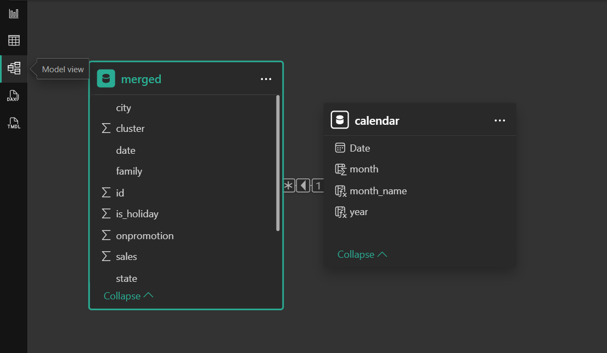

# 🛒 Retail Sales Performance Dashboard (Power BI)

## Overview
Power BI dashboard analyzing retail sales across stores, cities, categories, and time.

## Key Features
- KPI Cards (branches, max sales, items, total revenue)
- Monthly sales trend
- Top selling categories
- Top 10 cities by sales
- Sales by cluster
- Working days vs holidays

## Dataset
Source: Kaggle - Store Sales (Ecuador)
Competition: Store Sales - Time Series Forecasting

> Dataset is not included in this repo.

## 📊 Dashboard Screenshots

### Overview

### Sales Matrix

### Top Cities

### Data Model

## How to Use
1. Download the `.pbix` file.
2. Open using Power BI Desktop.
3. Load dataset (from Kaggle) and refresh.
